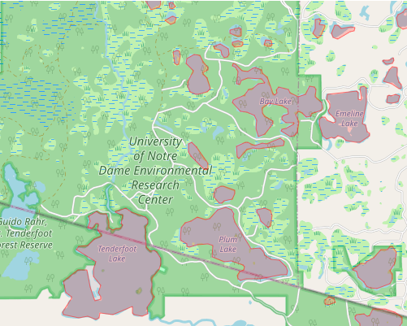

# lakeLatLongFinder
A simple shiny app to retrieve lat/long coords for lakes.

## How to launch
There are two ways to run this app.
1) Run it locally. To do this, click the green "Code" download button on the app's main page to download the folder. Then open the file "app.R" in RStudio and click "Run App" at the top right corner of the script window. Or if you're not using RStudio, navigate to the directory where app.R lives:

```
library(shiny)
runApp("app.R")
```

2) The easier way: visit the app online. As of August 2020, you can [access it here](https://gahmkcaryinstitute.shinyapps.io/lakeLatLongFinder/)

## Data sources
The data for this app is from NHDPlus, version 2 (https://nhdplus.com/NHDPlus/NHDPlusV2_data.php). The datasets used are the shapefiles for the Great Lakes region and the Upper Mississippi River region.

## Contributors
App developed by Kaija Gahm. Help with spatial analyses from Stuart Jones.

Questions? Please email gahmk@caryinstitute.org. I'd be happy to help! I also welcome any feedback, since this app is currently in development.
